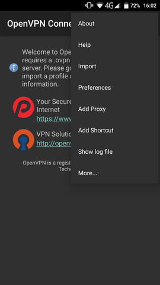
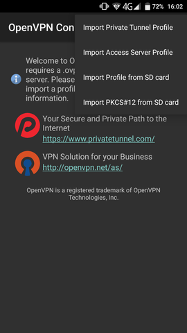
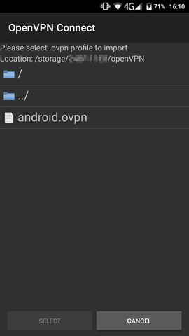
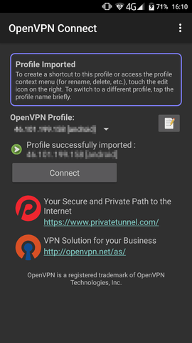
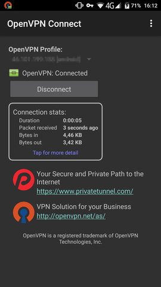
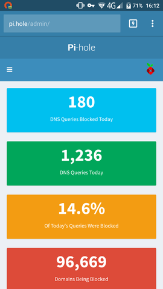

- Install the official OpenVPN App from the [App Store](https://play.google.com/store/apps/details?id=net.openvpn.openvpn)

- Log into your OpenVPN server and use the road warrior installer to create a new certificate for your device:

```
root@ubuntu-512mb-fra1-01:~# bash openvpn-install.sh
Looks like OpenVPN is already installed

What do you want to do?
   1) Add a cert for a new user
   2) Revoke existing user cert
   3) Remove OpenVPN
   4) Exit
Select an option [1-4]: 1

Tell me a name for the client cert
Please, use one word only, no special characters
Client name: android
Generating a 2048 bit RSA private key
.....+++
..................................+++
writing new private key to '...'
-----
Using configuration from /etc/openvpn/easy-rsa/openssl-1.0.cnf
Check that the request matches the signature
Signature ok
The Subject's Distinguished Name is as follows
commonName            :ASN.1 12:'android'
Certificate is to be certified until Jan 25 15:07:37 2027 GMT (3650 days)

Write out database with 1 new entries
Data Base Updated

Client android added, configuration is available at /root/android.ovpn
```

- Copy the mentioned file (`/root/android.ovpn`) to your Android device (e.g. SD card) and import it in the app:

 

 

 

 

- Connect to your OpenVPN server

  

- You are ready to go!

  
