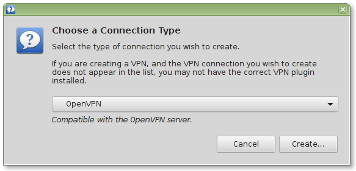
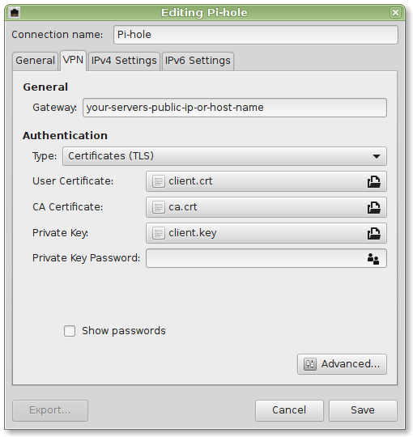
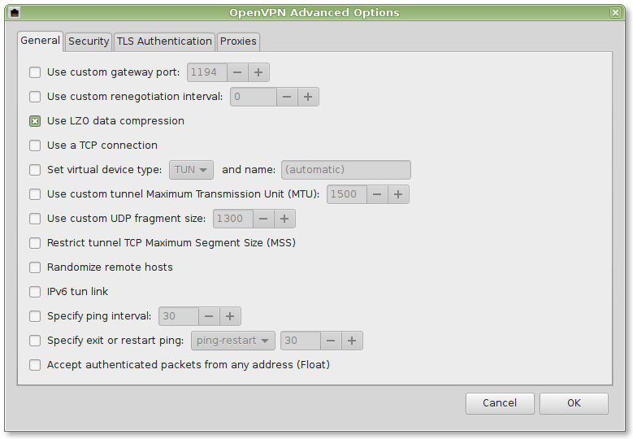
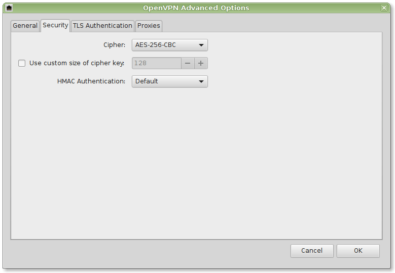
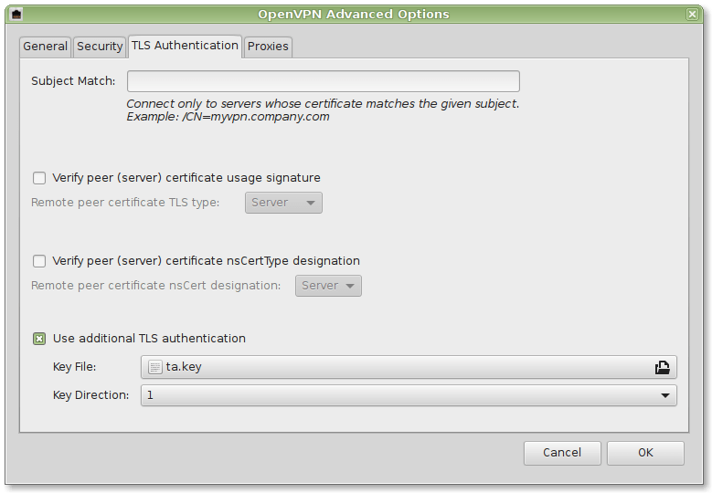

### Connect from a client
There are various tutorials available for all operating systems for how to connect to an OpenVPN server.

### Create certificate
Log into your OpenVPN server and use the road warrior installer to create a new certificate for your client:
```
bash openvpn-install.sh 
```

```
Looks like OpenVPN is already installed

What do you want to do?
   1) Add a cert for a new user
   2) Revoke existing user cert
   3) Remove OpenVPN
   4) Exit
Select an option [1-4]: 1

Tell me a name for the client cert
Please, use one word only, no special characters
Client name: android
Generating a 2048 bit RSA private key
.....+++
..................................+++
writing new private key to '...'
-----
Using configuration from /etc/openvpn/easy-rsa/openssl-1.0.cnf
Check that the request matches the signature
Signature ok
The Subject's Distinguished Name is as follows
commonName            :ASN.1 12:'android'
Certificate is to be certified until Jan 25 15:07:37 2027 GMT (3650 days)

Write out database with 1 new entries
Data Base Updated

Client android added, configuration is available at /root/android.ovpn
```

**WARNING** Anyone who gets his hands on this configuration/certificate file can obtain full access to your VPN. Make sure that you use only trusted paths for transferring the file (e.g. *never* send it via an un-encrypted channel, e.g. email or FTP). Best strategy is to use a USB thumb drive to avoid any network transport at all. Make sure to delete the certificate on the USB drive afterwards.

**NOTICE** If one of your certificates has been compromised, remove it using option `2` (see above) and generate a new certificate. This will effectively lock out anyone who might have gotten access to the certificate.

### Linux
I'll demonstrate the procedure here for Ubuntu Linux (which trivially extends to Linux Mint, etc.)

1. Install the necessary network-manager plugins
```
sudo apt-get install network-manager-openvpn network-manager-openvpn-gnome
sudo service network-manager restart
```

2. Securely copy the necessary certificates from your OpenVPN server to your client (e.g. using `sftp`). They are located in `/etc/openvpn/easy-rsa/pki`

You will need:

* User Certificate: `/etc/openvpn/easy-rsa/pki/issued/client.crt`
* CA Certificate: `/etc/openvpn/easy-rsa/pki/ca.crt`
* Private Key: `/etc/openvpn/easy-rsa/pki/private/client.key`
* Private Key Password: Depending on your settings (might even be empty)
* TA Key: `/etc/openvpn/ta.key`

Further details can be found in the screenshots provided below:






Your whole network traffic will now securely be transferred to your Pi-hole.


### Windows

You will have to install additional software. See https://openvpn.net/index.php/open-source/downloads.html