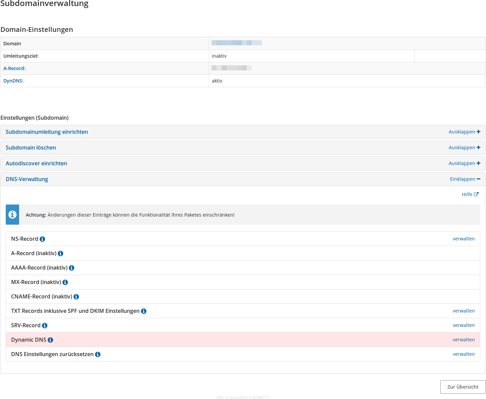
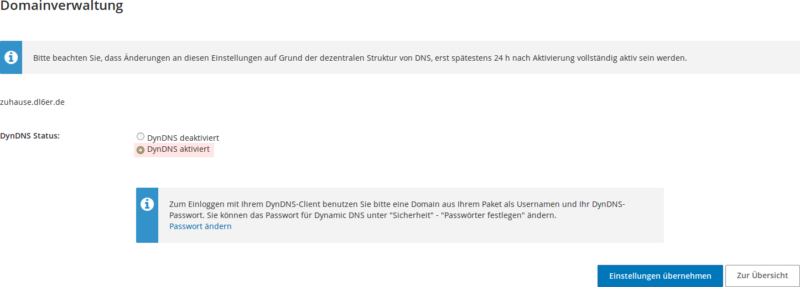
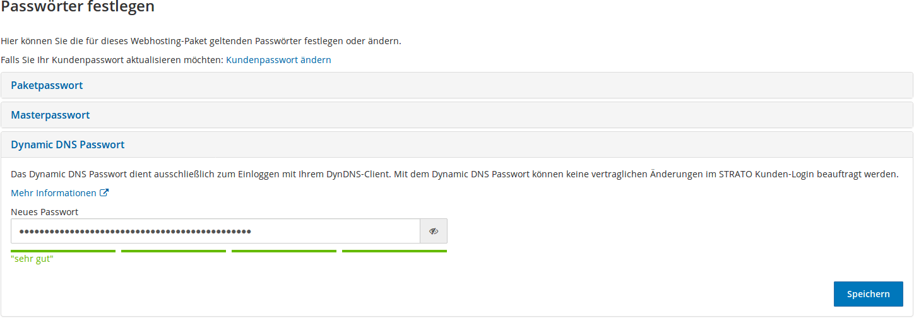

If you operate your Pi-hole + OpenVPN at home, it is very likely that you are sitting behind a NAT / dynamically changing IP address. In this case, you should set up a dynamic DNS record, which allows you to reach your server. You can exchange the address that has been configured during the setup of OpenVPN like this:

```bash
vim /etc/openvpn/server/client-common.txt
```

Look for the `remote` line and adjust it accordingly (remove IP address, add host name), e.g.

```text
remote home.mydomain.de 1194
```

This change has to be repeated in each client config file (`*.conf`) that you have been created up till now.

If you have set up a DDNS domain for your IP address, you will likely need to add a host-record to Pi-hole's settings.

```bash
pihole -a hostrecord home.mydomain.de 192.168.1.10
```

If you don't do this, clients (like the Android OpenVPN client) will not able to connect to the VPN server when *inside the internal network* (while it will work from outside).  Afterwards, the client will be able to connect to the VPN server both from inside and outside your local network.

## Setting up DynDNS update

If your router cannot update the dynamic DNS record, you can use for example `ddclient`.

```bash
sudo apt install ddclient
```

This configuration file resides in `/etc/ddclient.conf`. During installation, `apt` probably already asked you some questions and prepared a useful config file. In general, configuration files look like:

```bash
# /etc/ddclient.conf
#
protocol=dyndns2
use=web
login=mylogin
password=mypassword
myhost.dyndns.org
```

If you want to have `ddclient` running as daemon (recommended!), change also your `/etc/defaults/ddclient` to:

```bash
# Configuration for ddclient scripts
# generated from debconf on Do 9. Feb 22:29:13 CET 2017
#
# /etc/default/ddclient

# Set to "true" if ddclient should be run every time DHCP client ('dhclient'
# from package isc-dhcp-client) updates the systems IP address.
run_dhclient="false"

# Set to "true" if ddclient should be run every time a new ppp connection is
# established. This might be useful, if you are using dial-on-demand.
run_ipup="false"

# Set to "true" if ddclient should run in daemon mode
# If this is changed to true, run_ipup and run_dhclient must be set to false.
run_daemon="true"

# Set the time interval between the updates of the dynamic DNS name in seconds.
# This option only takes effect if the ddclient runs in daemon mode.
daemon_interval="300"
```

### Example: Strato DynDNS

In the following, we give an example of how to setup `ddclient` using the German Internet hosting provider Strato. First, you need to create a subdomain. Then you need to enable DnyDNS for this domain:



---



---



Afterwards, modify your `ddclient` config file to look like:

```bash
protocol=dyndns2
use=if, if=eth0
use=web, web=checkip.dyndns.org
server=dyndns.strato.com/nic/update
login=strato-login-name
password='password1234'

meine.domain.de
```

where you replace `strato-login-name` by your Strato login name (most likely your domain name, like `maxmustermann.de`), `password1234` by the password you configured above (see third screenshot), and `meine.domain.de` by the subdomain you created and enabled dynamic DNS for.
